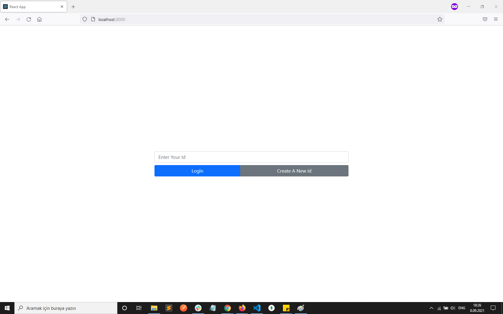
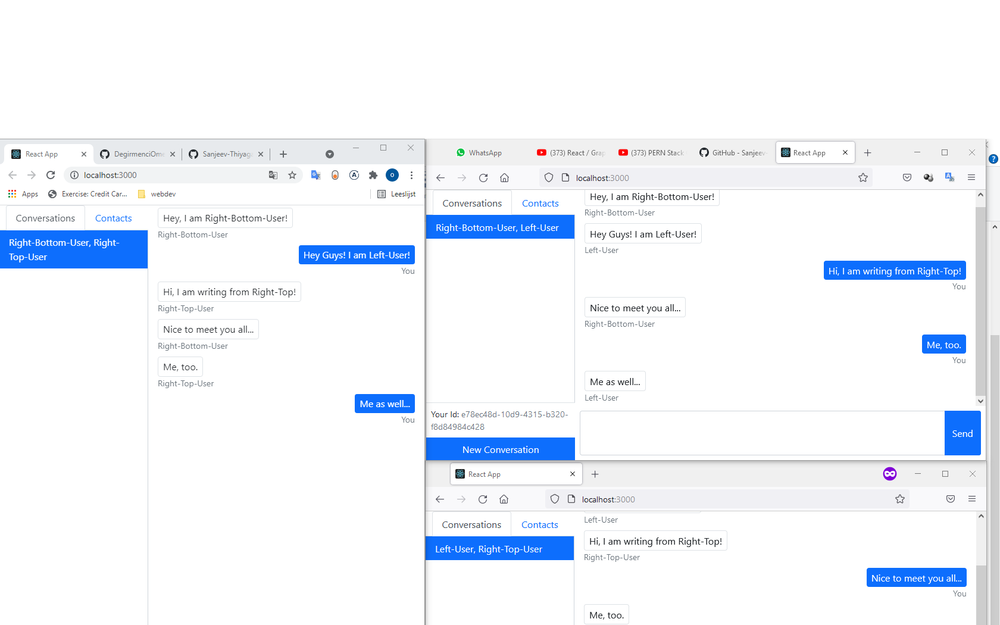

# Chat-App

## General Info
A chat application which can be used not only for private messaging, but also as a group chat. It doesn't require a phone number, you can generate a unique ID instead to get started with the application. All you need to do is add your friends into your contact list with their IDs and enjoy this cool chat! 😎

## Login Page

- Users can login with their IDs if they already have, or just generate a new one by clicking 'Generate New Id'

## Contacts

- Users need the IDs from other users to add them to the Contacts list.

## Conversations

- Each user needs to add the users in the conversation. Then they can start chatting.

## Technologies 
- Backend: NodeJS, Express, Socket.io
- Frontend: ReactJS, UUID to generate user IDs
- UI: React Bootstrap

 
 ## Clone this repository

\$ git clone https://github.com/DegirmenciOmer/Chat-App.git

 ## Reference
 This project was initially coded along with (this tutorial)[https://www.youtube.com/watch?v=tBr-PybP_9c].

